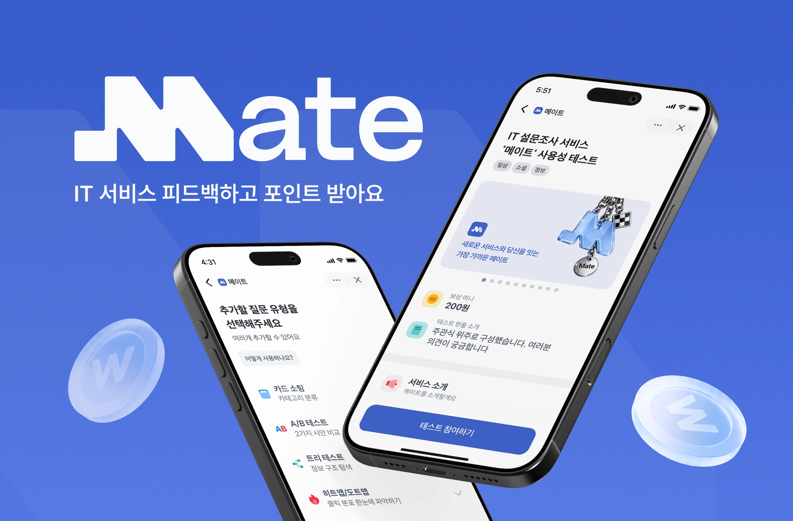
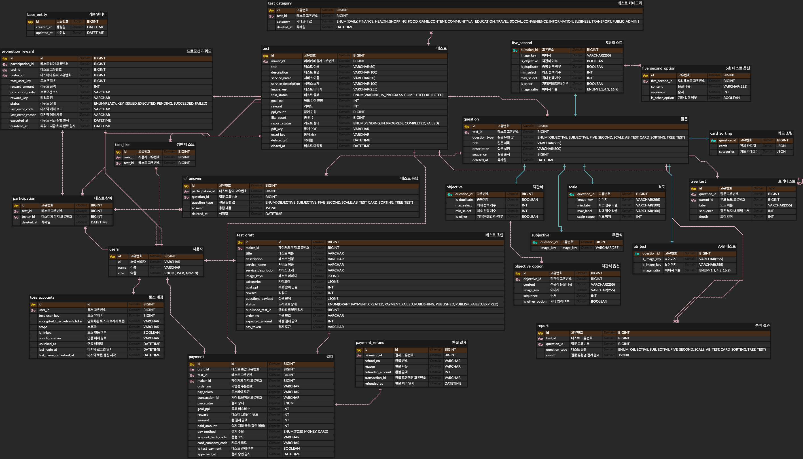
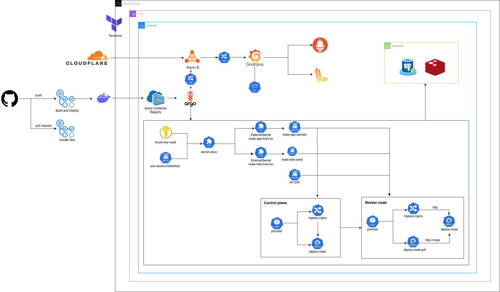

## 💠 Mate Server


> **메이커의 첫 유저, 테스터의 첫 보상 — MATE**

세상에 막 발을 내딛는 신규 서비스 **MAKER**와 새로운 서비스를 가장 먼저 경험하고 싶은 **TESTER**를 이어주는 앱인토스 기반 테스트 리워드 플랫폼입니다. s메이커는 진짜 유저로부터 유의미한 피드백을 얻고 테스터는 자신의 피드백 가치를 토스 포인트로 돌려받는 선순환 구조를 지향합니다.

<p align="center">
  
</p>

<br/>

<br/>

### ✨ Key Features

---

| 기능 | 설명 |
|------|------|
| **다양한 질문 유형** | 객관식, 주관식, 5초 테스트, 척도, A/B 테스트, 카드 소팅, 트리 테스트 7가지 지원 |
| **토스 페이 결제** | 테스트 게시 시 토스페이로 리워드 결제, 테스터 참여 완료 시 자동 지급 |
| **PDF / Excel 리포트** | 응답 집계 결과를 유형별 차트와 함께 PDF/Excel로 자동 생성 |
| **토스 로그인** | 토스 소셜 로그인 기반 간편 인증 |

<br/>


### 👩🏻‍💻 Developers

---


| 이름 | GitHub |
|------|--------|
| 박소윤 | [@happine2s](https://github.com/happine2s) |
| 송현빈 | [@hyunbin7664](https://github.com/hyunbin7664) |
| 장민지 | [@rossenzii](https://github.com/rossenzii) |

<br/>


### 🛠️ Tech Stack

---

#### Backend


#### Database & Cache


#### PDF Server


#### Infrastructure


#### Monitoring


#### CI/CD


#### External


<br/>


### 📁 Project Structure

---

```
src/main/java/server/MATE/
├── domain/
│   ├── auth/            # 인증 (JWT 발급, 재발급, 로그아웃)
│   ├── users/           # 회원 정보
│   ├── test/            # 테스트 등록·조회·상태 관리
│   ├── testdraft/       # 테스트 초안 작성·수정
│   ├── question/        # 질문 생성·조회 (7가지 유형별 핸들러)
│   ├── answer/          # 테스터 응답 등록
│   ├── participation/   # 테스트 참여 내역
│   ├── payment/         # 결제 등록·실행·환불
│   ├── promotion/       # 리워드 지급
│   └── report/          # 리포트 집계·PDF·Excel 생성
├── global/
│   ├── security/        # Spring Security 필터·핸들러 설정
│   ├── common/          # 공통 예외·응답·유틸
│   ├── storage/         # Azure Blob Storage 파일 업로드
│   ├── claude/          # Claude AI 연동
│   └── discord/         # Discord 웹훅 알림
└── toss/                # 토스 로그인·결제 API 클라이언트

pdf-server/              # Node.js + Playwright PDF 렌더링 서버
deploy/                  # Kubernetes 매니페스트 (ArgoCD GitOps)
infra/terraform/         # Azure 인프라 IaC
```

<br/>


### 🚀 Features

---

**1️⃣ 테스트 생성 및 게시:**
메이커는 초안 상태에서 테스트를 자유롭게 구성한 뒤 토스페이로 테스터 리워드를 결제하면 테스트가 게시됩니다. 질문은 객관식, 주관식, 5초 테스트, 척도, A/B 테스트, 카드 소팅, 트리 테스트 7가지 유형을 지원하며 각 유형은 독립된 테이블로 정규화되어 관리됩니다.

**2️⃣ 테스터 참여 및 리워드 지급:**
테스터가 테스트에 참여해 모든 질문에 응답을 제출하면 참여가 완료되고 토스 프로모션 API를 통해 리워드가 자동 지급됩니다. 동일 테스트에 중복 참여는 DB 유니크 제약으로 방지합니다.

**3️⃣ 리포트 자동 생성:**
테스트가 마감되면 응답 데이터를 질문 유형별로 집계해 리포트를 생성합니다. 결과는 Excel 파일과 PDF 리포트로 다운로드할 수 있으며 PDF는 Node.js + Playwright 서버에서 HTML 차트를 렌더링해 생성합니다.

**4️⃣ 인증 및 보안:**
토스 소셜 로그인으로 인증 후 자체 JWT(Access/Refresh Token)를 발급합니다. Refresh Token은 Redis에 저장하고 Rotation 방식으로 관리하며, 토큰 불일치 시 탈취로 간주해 세션 전체를 즉시 무효화합니다.

<br/>


### 🗄️ ERD

---

<p align="center">
  
</p>

<br/>


### 🏗️ Architecture

---

<p align="center">
  
</p>

<br/>

### ☁️ Infrastructure Overview

---

| 구성 요소 | 내용                                                              |
|-----------|-----------------------------------------------------------------|
| **클러스터** | Azure VM 2대로 직접 구성한 Kubernetes 클러스터                             |
| **배포** | GitHub Actions → ACR 이미지 빌드/푸시 → ArgoCD GitOps 자동 배포            |
| **시크릿 관리** | Azure Key Vault + External Secrets Operator → K8s Secret 자동 동기화 |
| **네트워크** | Azure Load Balancer → ingress-nginx → ClusterIP Service         |
| **모니터링** | Prometheus + Grafana (메트릭) / Loki + Promtail (로그)               |
| **IaC** | Terraform으로 Azure 인프라 전체 코드화                                    |
